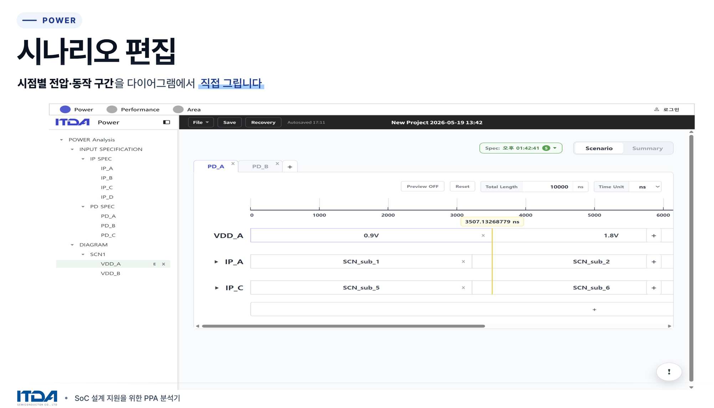
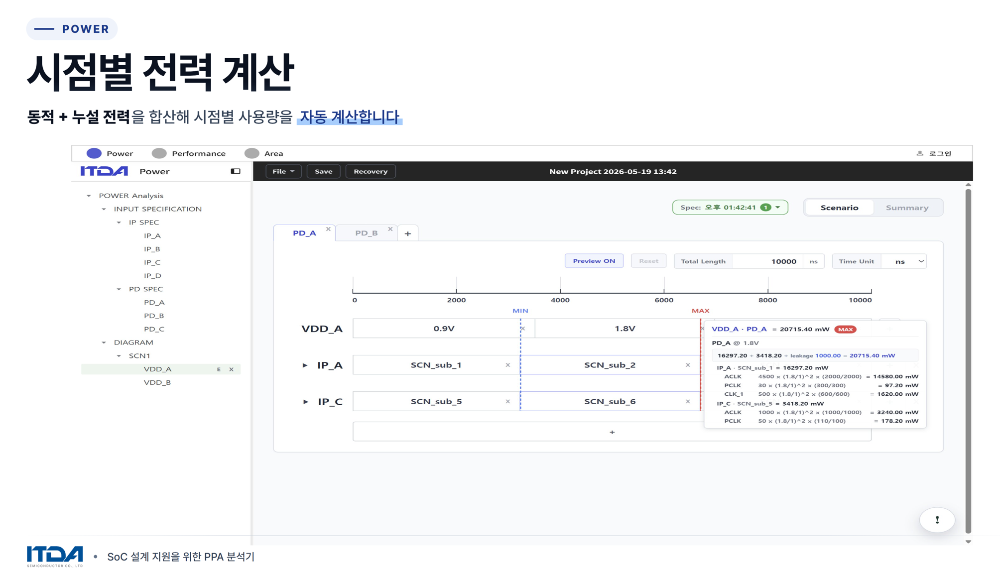
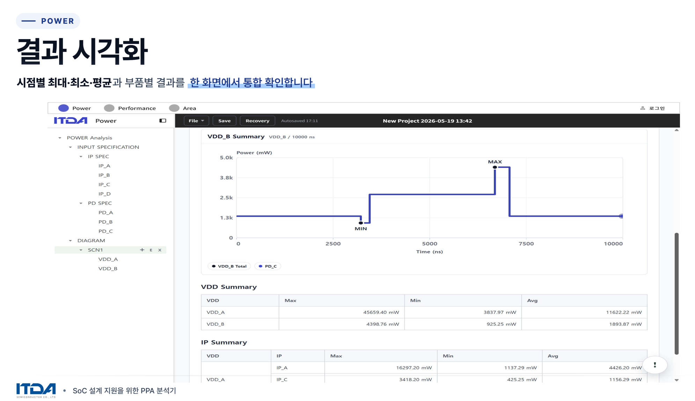
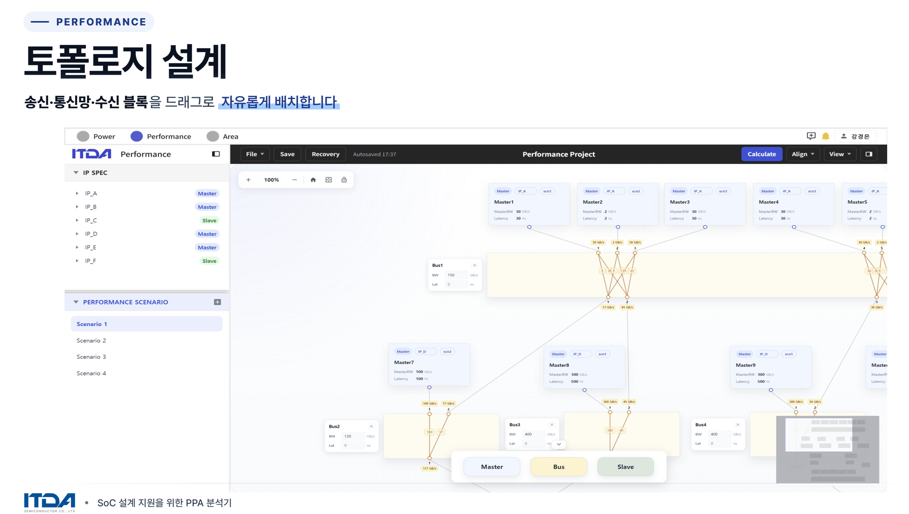
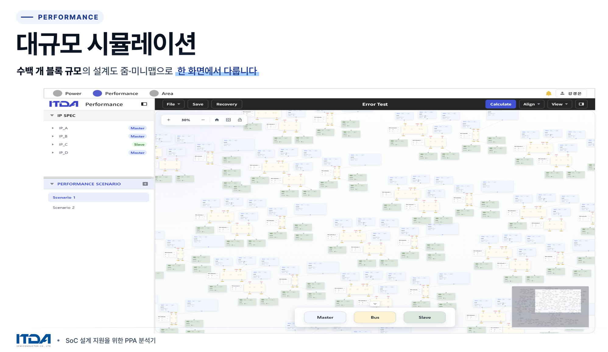
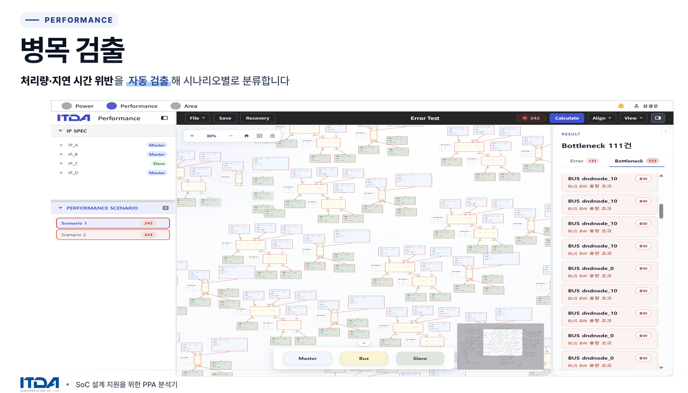
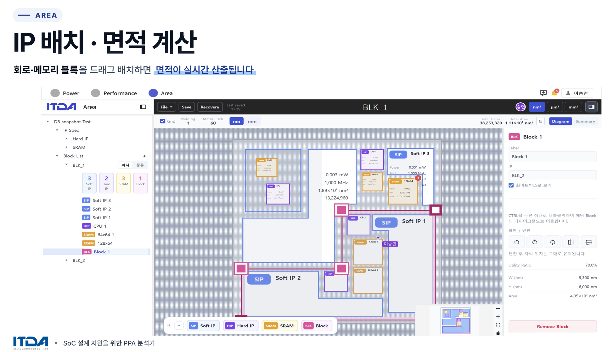
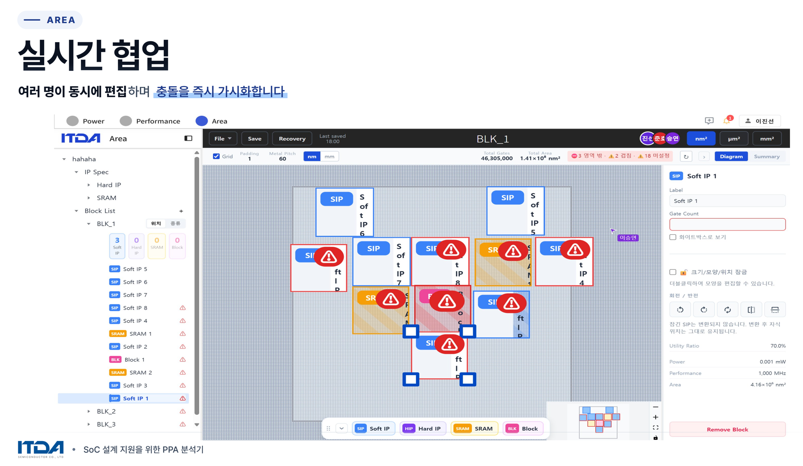

## 📟 SoC 설계 지원을 위한 PPA 분석기 개발
> 🔒 **Notice**
> 본 프로젝트는 **잇다반도체**와의 기업연계 프로젝트로, 소스 코드는 비공개 처리되어 있습니다.
> 코드 열람이 필요하신 경우 별도로 문의해 주시면 감사하겠습니다.

SoC 설계 과정의 Power / Performance / Area (PPA) 수치를 통합적으로 분석·비교·시각화하는 웹 대시보드를 개발한다.

<br/>

## 1. 기업명
[**잇다반도체**](https://itdasemi.com/)

<br/>

## 2. 목표
설계자가 수작업·스크립트·엑셀로 분산 수행하던 **PPA 분석**을 **자동화**하고, 설계 변경이 **PPA 수치에 주는 영향을 한 화면에서 비교**할 수 있도록 한다.

| 구분 | 내용 |
|---|---|
| 사용 대상 | SOC 설계 엔지니어 |
| 산출물 | PPA 분석기 사이트 / 개발·테스트 코드 / 사용자 매뉴얼 |
| 배포 수준 | 실서비스 수준 (Power·Performance·Area 세 파트 통합) |

<br/>

## 3. 팀원 정보 및 역할 분담
SSAFY 14기 서울 5반(기업연계1반) S101조

| 이름 | 역할 | 담당 |
|---|---|---|
| 김건희 | Power | 전력 관련 입력/시나리오 편집 UI, 타임라인/시나리오 관리 및 스냅샷 기능 구현, Pinia 기반 저장소로 상태·자동저장 연동 및 API 통신 처리
| 손준호 | 팀장, Performance | 성능 계산/분석 엔진 구현 및 경로 탐색, 단위 정규화, 토폴로지 캐시 등 알고리즘 책임, 성능 그래프·버스·노드 편집, 뷰포트 컬링·히스토리·밴드위스 쿼리 등 사용자 상호작용 구현
| 강경은 | Performance, Infra | API 설계·성능 데이터 모델 반영 및 응답 최적화, 룰·검증 로직과 성능 시뮬레이션 결과의 시각화 및 협업 동기화 구현, Jenkins를 이용한 CI/CD 파이프라인 설계 및 관리
| 이승연 | Area | Area 다이어그램에서 노드·버스·그룹·연결선 렌더링, 커스텀 노드 컴포넌트와 스타일링, 줌·팬·미니맵 지원 구현, 노드 드래그·드롭, 멀티선택, 노드 연결/분리, 컨텍스트 메뉴, 키보드 단축키(복사·붙여넣기·삭제 등) 및 직관적 UX 제공
| 이진선 | Area | 노드 목록, 선택/편집 상태, 뷰포트·스케일, 임시 저장 상태 등 Area 관련 상태를 Pinia로 중앙화하고 API와 양방향 동기화 구현, CRUD 및 스냅샷 저장/복원, 임포트/익스포트 지원 구현, 실시간 커서/편집 오버레이, 변경 전파·동기화, 협업 알림·권한 고려한 UI 제공

<br/>

## 4. 주요 기능 및 화면
### ⚡ Power 기능






<br/>

### 🧵 Performance 기능






<br/>

### 🧩 Area 기능




<br/>

## 5. 시스템 아키텍처
### 프론트엔드 
- **Header**: 최상단 전체 폭에 위치하며 Power·Performance·Area 파트 전환 탭을 포함한다. 파트 전환과 관계없이 유지된다.
- **Nav-Header**: 좌측 사이드바 상단에 위치한다.
- **Page-Header**: 우측 메인 영역 상단에 위치한다.
- **Navigation**: 좌측 사이드바 본문으로 페이지 간 이동 메뉴를 제공한다.
- **Page**: 우측 메인 콘텐츠 영역이다.

<br>

- **Vue 3 SPA**로 구성되며 `home / power / performance / area` 4개 라우트로 분리된다. 
- 전역 상태는 **Pinia로 관리**한다. 
- 브라우저에서 즉시 계산 가능한 단순 값(슬라이더 미리보기, 기본 면적 등)은 프론트에서 처리하고 백엔드를 호출하지 않는다.

<br>

| 라이브러리 | 용도 |
|---|---|
| Vue 3 | SPA 프레임워크 |
| Vue Router | 파트별 라우팅 |
| Pinia | 전역 상태 관리 |
| Vuetify | 공통 UI 컴포넌트 |
| Naive UI | 테이블 컴포넌트 |
| Vue Flow | Area 다이어그램 |
| splitpanes | 분할 레이아웃 |
| TypeScript | 언어 |

<br>

### 백엔드

- **Python과 FastAPI** 단일 구성으로 운용하며, Node.js 별도 서버는 사용하지 않는다.
- FastAPI는 프론트가 보낸 입력(IP 스펙, 시나리오, 배치)을 받아 Power / Performance / Area 수치를 계산해 반환한다.
- 그래프 탐색(Performance 병목 분석), 다수 블록 합산 같은 복합 계산과 DB 연동·파일 업로드 같은 외부 시스템 접점을 담당한다.

<br>

| 라이브러리 | 용도 |
|---|---|
| FastAPI | REST API 서버 |
| uvicorn | ASGI 서버 |

<br>

### 데이터베이스 

- DB는 **MongoDB**를 사용한다.
- MongoDB 연결 시점에 저장/불러오기 지점을 API 호출로 교체할 수 있도록 입출력 경계를 분리해 둔다.

<br>

### 인프라 

- **CI/CD**: GitLab push를 트리거로 **Jenkins**에서 빌드·배포 후, **Nginx**가 정적 파일을 서빙하면서 `/api` 요청을 FastAPI로 프록시한다.
- **Nginx**: `/` 경로로 Vue SPA를 서빙하고, `/api` 경로로 FastAPI 리버스 프록시를 연결하며, CORS 헤더를 설정한다.

<br/>

## 6. 개발 가이드
### 환경 설정
```
cd FE
npm install
```

<br>

### 실행 방법
- 로컬 접속 주소 http://localhost:8080 이다.
- 서버 접속 주소는 https://k14s101.p.ssafy.io/dev/home 이다.

```
cd FE
npm run serve
```